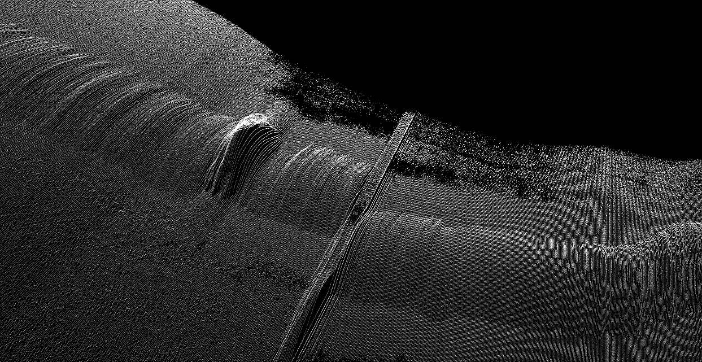

# PyQtGraph 初探

PyQtGraph是基于PyQt4 / PySide和numpy构建的纯Python图形和GUI库，旨在用于数学/科学/工程应用中。尽管完全用python编写，但是由于依赖numpy进行数字处理和Qt的GraphicsView框架进行显示，使得该库速度非常快。

## 背景

扫描焊缝轮廓，获得的数据存放在 1900 个文件中，每个文件多达 1000~1800个（x, y）数据点，现在想要用这些数据绘制出焊缝轮廓。

最初考虑使用 matplotlib 画图，但是画出来之后想要拖动角度观察细节时却相当卡顿，几乎卡死。

经过一番检索后得知 matplotlib 绘图主要用于出版，实时性能较弱。想要获得较好的实时性能可以考虑使用PyQtGraph

## 安装

```bash
pip install pyqtgraph
# 你可能还需要安装 pyqt4/pyqt5/pyside, numpy
```

## 官方示例

该库提供了一系列示例，可以通过 pyqtgraph.examples 获取

```python
import pyqtgraph.examples
pyqtgraph.examples.run()
```

## 二维 `plot` 示例

```python
import numpy as np
import pyqtgraph as pg

data = np.random.normal(size=1000)
pg.plot(data, title="Simplest possible plotting example")

data = np.random.normal(size=(500,500))
pg.image(data, title="Simplest possible image example")

## 如果直接运行该脚本，需要启动Qt事件循环，否则脚本将不阻塞而直接运行完毕退出，出现现象是窗口一闪而过，程序退出。
## Start Qt event loop unless running in interactive mode or using pyside.
if __name__ == '__main__':
    import sys
    if sys.flags.interactive != 1 or not hasattr(QtCore, 'PYQT_VERSION'):
        pg.QtGui.QApplication.exec_()
```

## 三维 `surface_plot` 示例

```python
from pyqtgraph.Qt import QtCore, QtGui
import pyqtgraph as pg
import pyqtgraph.opengl as gl
import numpy as np

## Create a GL View widget to display data
app = QtGui.QApplication([])
w = gl.GLViewWidget()
w.show()
w.setWindowTitle('pyqtgraph example: GLSurfacePlot')
w.setCameraPosition(distance=50)

## Saddle example with x and y specified
x = np.linspace(-8, 8, 50)
y = np.linspace(-8, 8, 50)
z = 0.1 * ((x.reshape(50,1) ** 2) - (y.reshape(1,50) ** 2))
p2 = gl.GLSurfacePlotItem(x=x, y=y, z=z, shader='shaded')
w.addItem(p2)

## Start Qt event loop unless running in interactive mode or using pyside.
if __name__ == '__main__':
    import sys
    if sys.flags.interactive != 1 or not hasattr(QtCore, 'PYQT_VERSION'):
        pg.QtGui.QApplication.exec_()
```

## 三维 `scatter_plot `示例

```python
from pyqtgraph.Qt import QtCore, QtGui
import pyqtgraph as pg
import pyqtgraph.opengl as gl
import numpy as np

## Create a GL View widget to display data
app = QtGui.QApplication([])
w = gl.GLViewWidget()
w.show()
w.setWindowTitle('pyqtgraph example: GLScatterPlot')
w.setCameraPosition(distance=3)

pos = np.random.random(size=(100000,3))
sp = gl.GLScatterPlotItem(pos=pos, color=(1,1,1,1), size=0.1)
w.addItem(sp)

## Start Qt event loop unless running in interactive mode or using pyside.
if __name__ == '__main__':
    import sys
    if sys.flags.interactive != 1 or not hasattr(QtCore, 'PYQT_VERSION'):
        pg.QtGui.QApplication.exec_()
```

## 应用

```python
from pyqtgraph.Qt import QtCore, QtGui
import pyqtgraph.opengl as gl
import numpy as np

app = QtGui.QApplication([])
w = gl.GLViewWidget()
w.opts['distance'] = 20
w.show()
w.setWindowTitle('pyqtgraph example: GLScatterPlotItem')

fileCntStart = 1
fileCntEnd = 1900
fileCnt = fileCntEnd-fileCntStart+1

pos = []

for i in range(fileCntStart,fileCntEnd+1,1):
    ## 数据文件名为 result1.txt ~ result1900.txt
    fileName =  './bean/result%d.txt'%(i)
    f = open(fileName,mode='r')
    line = f.readline()
    while line:
        [y,z] = line.split(' ')
        ## 文件序号作为 x
        ## 将所有 (x,y,z) 塞进 pos 中
        pos.append([float(i)/20,float(y),float(z)-50])   
        line = f.readline()     
    f.close()

pos = np.array(pos)

sp = gl.GLScatterPlotItem(pos=pos,color=(1,1,1,.3), size=0.001, pxMode=True)
w.addItem(sp)
## 由于笔者是直接在命令行运行脚本的，因此直接调用 Qt 事件循环阻塞函数，这样弹出的窗口才能正常工作
QtGui.QApplication.instance().exec_()
```

### 运行结果: 

运行后弹出绘制了所有采集散点数据的窗口，可以自由拖动观察焊缝形貌

